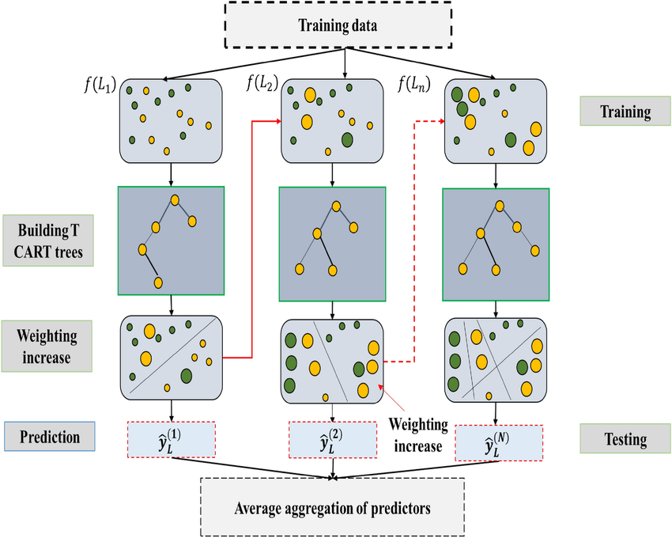
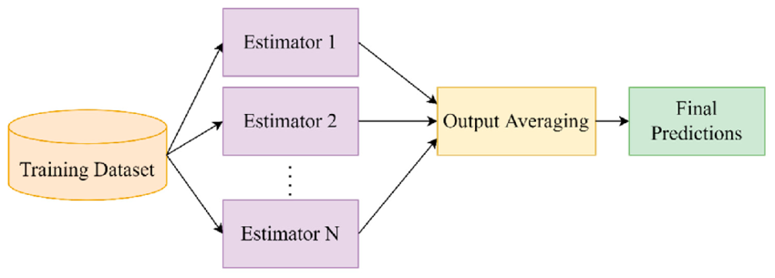

# Process Report

## Phase 1: Random Forest  

### Reason for Choosing the Model 🥸 

Our team selected the Random Forest model based on three main factors:  

1. **Simplicity and Accessibility**  
   Random Forest is a straightforward and easy-to-understand model. Since our team members had no prior experience with Machine Learning (ML) or Deep Learning (DL), Random Forest was our first thought upon analyzing the competition dataset.  

2. **Handling Nonlinear and Ordered Classification Problems**  
   This problem involves ordered classification with features related to health, behavior, etc., which are often non-linear. Random Forest is well-suited for handling such data due to its tree-based structure and reliance on Decision Trees, which effectively manage non-linear relationships.  

3. **Robustness to Missing and Imbalanced Data**  
   The dataset contains significant missing values and an imbalanced distribution of the target label `sii`:  
   - Label `0.0 (NONE)` accounts for over 50% of the data.
   - Label `1.0 (MILD)` accounts for over 26 of the data.
   - Label `2.0 (MODERATE)` accounts for over 13% of the data. 
   - Label `3.0 (SEVERE)` comprises less than 2% of the data.  
   Random Forest’s bagging ensemble mechanism helps mitigate overfitting and performs well in scenarios with imbalanced data.  

### Experimentation and Results 

#### Version 1: Initial Approach  🚀

1. **Preprocessing**  
   - Missing values were handled using `SimpleImputer`.  
   - Categorical data was encoded using `OrdinalEncoder`.  

2. **Model Training Strategy**  
   - Given the moderate size of the dataset (3960 samples, 82 features), we applied **K-Fold Cross Validation** to maximize dataset utilization and obtain reliable performance estimates.  

3. **Hyperparameter Optimization**  
   - Hyperparameters were tuned using a simple **Grid Search**, and evaluation was based on **accuracy**.  

**Result**:  
- <span style="color:orange">**Accuracy**: **0.216**</span>

Our team recognized that the low performance was likely due to overly simple implementation methods and suspected that imputing missing values for the `sii` target label was inappropriate.  

#### Version 2: Enhanced Approach  🤓

1. **Improved Hyperparameter Tuning and Metrics**  
   - Tried alternative hyperparameter tuning methods:  
     - **Random Search**: Achieved <span style="color:orange">**F1_weighted = 0.229**</span>  
     - **Bayesian Optimization**: Achieved <span style="color:orange">**F1_weighted = 0.240**</span>  
   - Changed the evaluation metric to **F1_weighted** instead of accuracy. F1_score provides a better balance between precision and recall, which is crucial given the class imbalance.  

2. **Alignment with Competition Metric**  
   - Used the required **Quadratic Weighted Kappa (QWK)** metric to evaluate performance and compare results.  

3. **Addressing Class Imbalance**  
   To handle the significant class imbalance in the `sii` target label, we experimented with the following techniques:  
   - **Undersampling**: Reduced the majority class sample size.  
   - **SMOTE (Synthetic Minority Oversampling Technique)**: Oversampled the minority class.  
   - **Combination of SMOTE and Undersampling**: Balanced both minority and majority classes.  

**Results**:  
- **Undersampling**: <span style="color:orange">**Submit score = 0.290**</span>  
- **SMOTE**: <span style="color:orange">**Submit score = 0.381**</span>
- **Combination of SMOTE and Undersampling**: <span style="color:orange">**Submit score = 0.377**</span>

Using **SMOTE** significantly improved the score. The improvement can be attributed to better representation of the minority class (label `3.0`), which constituted less than 2% of the dataset. By increasing the representation of this class, the model could learn its patterns more effectively.  

### Future Directions  

We aim to refine the model further by exploring additional techniques, including:  
- Advanced imputation strategies for missing values.  
- Feature engineering to capture complex relationships in the data.  
- Implementation of ensemble methods beyond Random Forest for improved performance.  

## Phase 2: Gradient Boosting

### Version 1: LightGBM
#### LightBGM

link: https://lightgbm.readthedocs.io/en/stable/


##### Reason for Choosing the Model

Since Random Forest did not meet our expectations, we switched to Gradient Boosting. We started with LightGBM due to its 
- Fast training speed 
- Superior handling of imbalanced data through boosting instead of bagging. 
- Histogram-based learning and leaf-wise splitting to reduce computations while maintaining accuracy. 

**The results were impressive, with a submission score of 0.4.** 

### Version 2: Hyperparameter tuning

#### Feature Engineering

Significant correlations between health-related features and age. These correlations indicated that age played a critical role in influencing the health metrics within our dataset.

``` python
def feature_engineering(df):
    # 1. Interaction Features:
    df['Age_and_BMI'] = df['Basic_Demos-Age'] * df['Physical-BMI']
    df['BP_Difference'] = df['Physical-Systolic_BP'] - df['Physical-Diastolic_BP']
    # 2. Aggregated Features:
    df['Avg_BMI'] = df.groupby('Physical-Season')['Physical-BMI'].transform('mean')
    df['BMI_Per_Weight'] = df['Physical-BMI'] / df['Physical-Weight']
    
    # 3. Temporal Features:
    df['Seasonal_BP'] = df.groupby('Physical-Season')['Physical-Diastolic_BP'].transform('mean')
    # 5. Ratios and Proportions:
    df['BMI_Height_Ratio'] = df['Physical-BMI'] / df['Physical-Height']
    df['HeartRate_to_Weight'] = df['Physical-HeartRate'] / df['Physical-Weight']

    # 6. Health Metrics:
    df['Frame_to_BMI'] = df['BIA-BIA_Frame_num'] / df['Physical-BMI']
    
    return df
```

**Submission score: 0.439.** 


### Version 3: Ensemble Learning

Combination of multiple gradient boosting models: **LightGBM**, **XGBoost**, **CatBoost** using VotingRegressor

#### XGBoost

link: https://xgboost.readthedocs.io/en/stable/

XGBoost, which stands for Extreme Gradient Boosting, is a scalable, distributed gradient-boosted decision tree (GBDT) machine learning library. It provides parallel tree boosting and is the leading machine learning library for regression, classification, and ranking problems.



#### CatBoost

link: https://catboost.ai/

Catboost is a variant of gradient boosting that can handle both categorical and numerical features. It does not require any feature encodings techniques like One-Hot Encoder or Label Encoder to convert categorical features into numerical features. It also uses an algorithm called symmetric weighted quantile sketch(SWQS) which automatically handles the missing values in the dataset to reduce overfitting and improve the overall performance of the dataset. 


#### Why we chose these models

1. Leverage the Advantages of Each Model
- **LightGBM**: Fast training and prediction speed, particularly effective with large datasets.
- **XGBoost**: High customizability and robust performance on various types of data.
- **CatBoost**: Excellent handling of categorical data with minimal preprocessing required.

2. Reduce Bias and Variance
- A voting ensemble reduces bias and variance by combining predictions from multiple models.
- Leveraging the unique features and strengths of each model makes the overall ensemble more stable and accurate.

3. Improve Overall Accuracy
- Combining **LightGBM**, **XGBoost**, and **CatBoost** capitalizes on the individual strengths of each model.
- This results in higher overall accuracy compared to using a single model.

4. Increase Prediction Reliability
- Using multiple models reduces the likelihood of individual model errors.
- When models agree or produce similar results, the reliability of predictions increases, minimizing the impact of errors from a single model.

5. Optimize for Different Types of Data
- The data exhibits a mix of numerical and categorical features:
  - **CatBoost** excels at handling categorical variables.
  - **LightGBM** and **XGBoost** are highly effective with numerical data and can optimize well for large datasets.
- Using all three models ensures robust handling of diverse data types, especially in the context of the problem.

#### VotingRegressor
link: https://scikit-learn.org/1.5/modules/generated/sklearn.ensemble.VotingRegressor.html

A voting regressor is an ensemble meta-estimator that fits several base regressors, each on the whole dataset. Then it averages the individual predictions to form a final prediction.



### Final Results
**Result: 0.45** 
